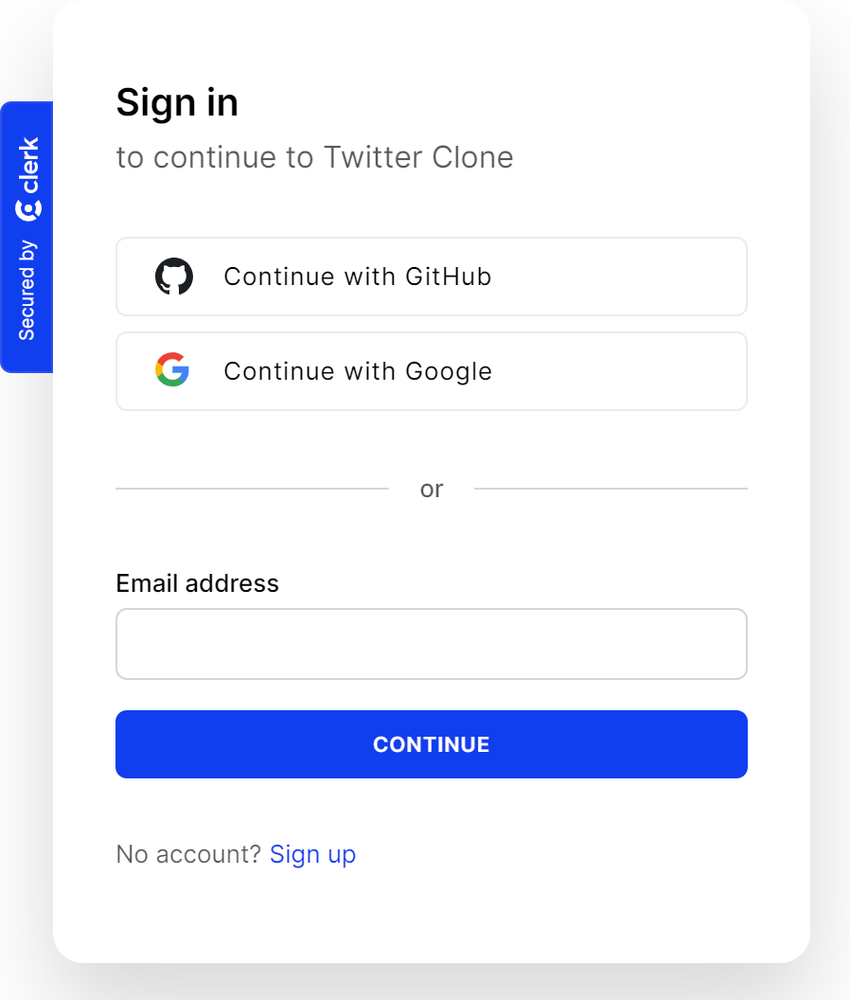
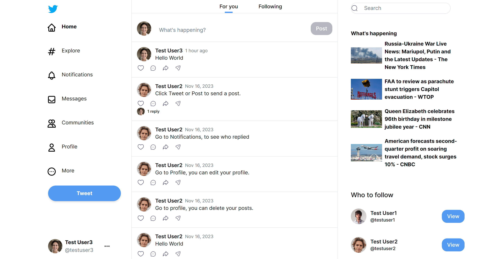
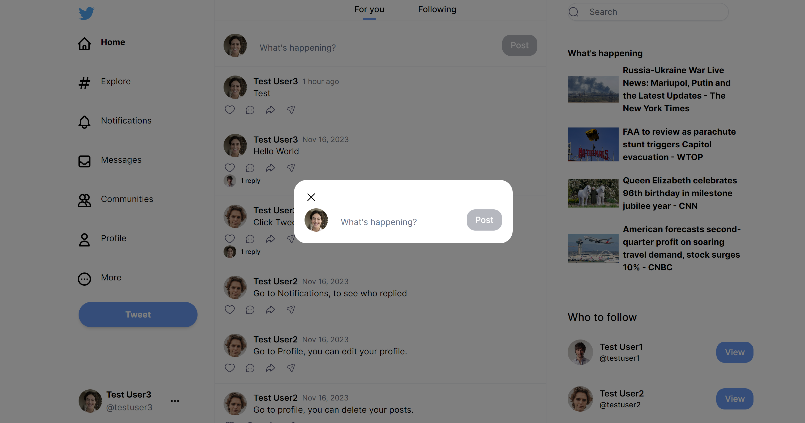
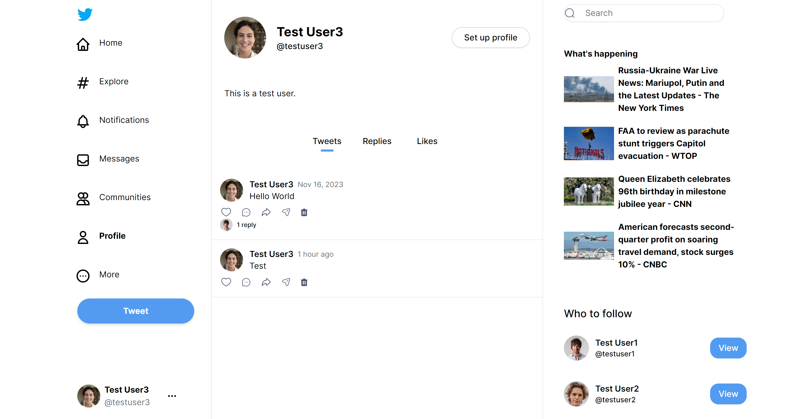
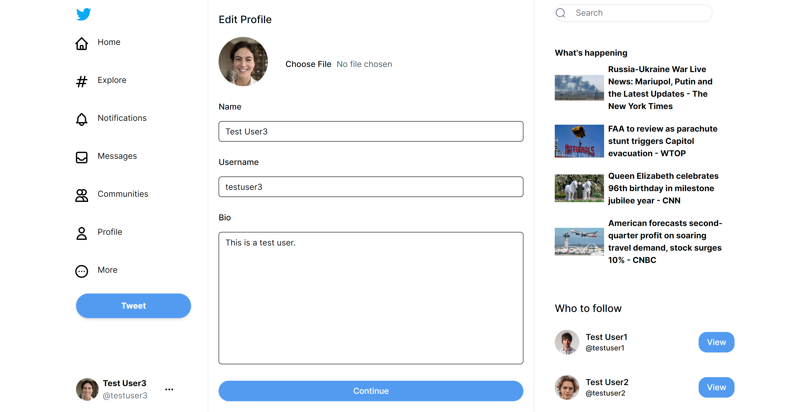
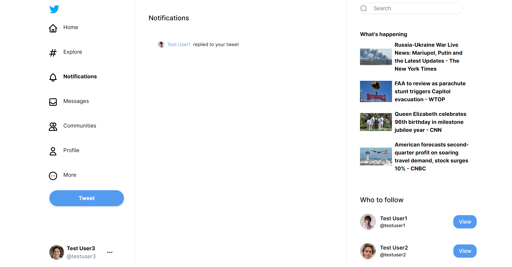
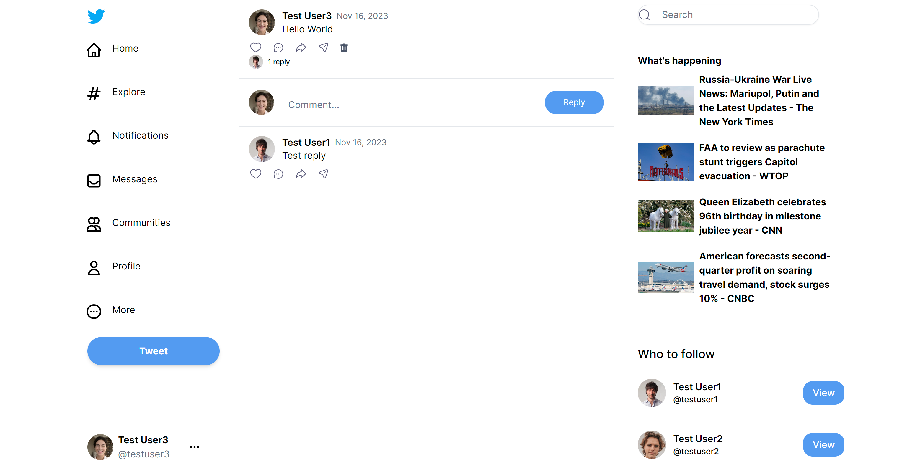
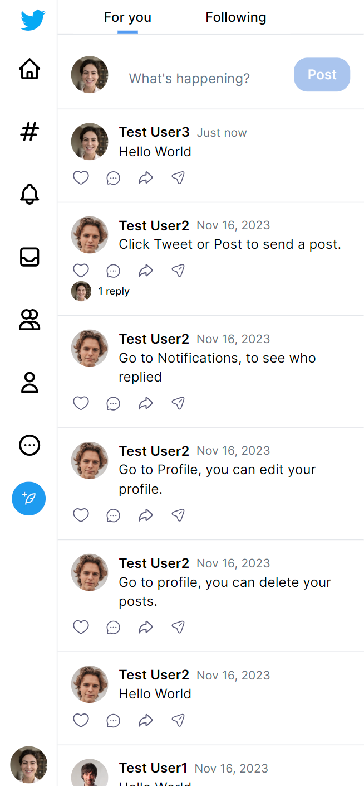

# Twitter Clone

### Description

This app offers a user experience similar to Twitter and integrates Clerk for secure authentication. It provides
various login options, including email, Google, and GitHub. Users can easily create and delete posts, interacting with
others through comments and replies. The platform allows for personalization of profiles and enforces a character limit
to ensure the dissemination of high-quality content. Additionally, the app features a dedicated news section, designed
to operate seamlessly across various devices, thereby enhancing the overall user experience.

### Technologies Used

- Next.js
- Tailwind CSS
- TypeScript
- MongoDB
- Radix UI
- Heroicons
- Clerk
- Zod
- UploadThing

### Key Features

- **Authentication:** Utilizes Clerk for robust user authentication, offering multiple sign-in options, including email,
  Google, and GitHub, to enhance user convenience.
- **Twitter-Style UI:** Provides users a familiar, user-friendly design for seamless navigation and interaction with
  posts and profiles.
- **Post Management:** Enables users to create posts with each post showing its posted time, delete posts, and engage
  through comments
  and replies, while receiving interaction notifications.
- **User Profile Editing:** Allows users to easily edit and update their profile
  information.
- **Character Limit Validation:** Utilizes Zod to enforce a character limit for prompts on user inputs during post
  creation, comments, replies, and profile updates, thereby improving the quality of user-generated content and
  preventing spammy or irrelevant submissions.
- **News Section:** Incorporates a dedicated news section, expanding the platform's scope beyond social interaction.
- **Responsive Design:** Supports various screen sizes for an optimal user experience across devices.

### Screenshots
- **Login Page**

  
  

- **Home Page**

  

- **Post**

  

- **Profile Page**

  

- **Edit Profile**

  

- **Notifications**

  

- **Comments**

  

- **Mobile Version of Home Page**

  